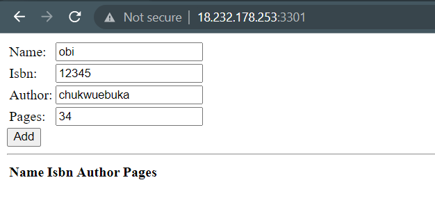

## **MEAN_STACK IMPLEMENTATION**
---
---

MEAN stack consist of the following stacks, MongoDB, ExpressJS, Angular and NODEJS.

1. MongoDB: A document-based, No-SQL database used to store application data in a form of documents.
2. MongoDB: A document-based, No-SQL database used to store application data in a form of documents.
3. Angular: A frontend framework. It is based on JavaScript, used to build User Interface (UI) components.
4. Node.js: A JavaScript runtime environment. It is used to run JavaScript on a machine rather than in a browser.

Here, as others, we will follow the steps below.

### **1. BACKEND CONFIGURATION INSTALL NODEJS**

- Update Ubuntu by running the code below

    `sudo apt update`

- Next, upgrade ubuntu by running the code below

    `sudo apt upgrade`

- Lets add a ca certification and run node from node source
    `sudo apt -y install curl dirmngr apt-transport-https lsb-release ca-certificates`

    `curl -sL https://deb.nodesource.com/setup_12.x | sudo -E bash - `

- Install Node.js on the server

    `sudo apt-get install -y nodejs`

- The command above installs nodejs.

- You can check the version of the nodejs and npm by running the code below.

    `node -v`

### **2. INSTALL MONGODB**

- First we add a keyserver for ubuntu
    `sudo apt-key adv --keyserver hkp://keyserver.ubuntu.com:80 --recv 0C49F3730359A14518585931BC711F9BA15703C6`

    `echo "deb [ arch=amd64 ] https://repo.mongodb.org/apt/ubuntu trusty/mongodb-org/3.4 multiverse" | sudo tee /etc/apt/sources.list.d/mongodb-org-3.4.list`

- Next we install Mongodb

    `sudo apt install -y mongodb`

- Then we start the server

    `sudo service mongodb start`

- We verify that the service is up and running

    `sudo systemctl status mongodb`


- Next we install npm node package manager

    `sudo apt install -y npm`

- Then we install body-parser package to help us process JSON files passed in request to the server.

    `sudo npm install body-parser`

- Let us create a folder called Books and cd into it.

    `mkdir Books && cd Books`

- In the Books directory, Initialize npm project

    `npm inti`

- Add a file to it named server.js then paste this block of code into it.

    `vi server.js`

```
var express = require('express');
var bodyParser = require('body-parser');
var app = express();
app.use(express.static(__dirname + '/public'));
app.use(bodyParser.json());
require('./apps/routes')(app);
app.set('port', 3300);
app.listen(app.get('port'), function() {
    console.log('Server up: http://localhost:' + app.get('port'));
});
```

### **3. INSTALL EXPRESS AND SETUP ROUTES TO THE SERVER**

- Next we install express and mongoose

    `sudo npm install express mongoose`

- In the book folder create a folder named apps

    `mkdir apps && cd apps`

- create a file named routes.js and paste the code below in it.

    `vi routes.js`

```
var Book = require('./models/book');
module.exports = function(app) {
  app.get('/book', function(req, res) {
    Book.find({}, function(err, result) {
      if ( err ) throw err;
      res.json(result);
    });
  }); 
  app.post('/book', function(req, res) {
    var book = new Book( {
      name:req.body.name,
      isbn:req.body.isbn,
      author:req.body.author,
      pages:req.body.pages
    });
    book.save(function(err, result) {
      if ( err ) throw err;
      res.json( {
        message:"Successfully added book",
        book:result
      });
    });
  });
  app.delete("/book/:isbn", function(req, res) {
    Book.findOneAndRemove(req.query, function(err, result) {
      if ( err ) throw err;
      res.json( {
        message: "Successfully deleted the book",
        book: result
      });
    });
  });
  var path = require('path');
  app.get('*', function(req, res) {
    res.sendfile(path.join(__dirname + '/public', 'index.html'));
  });
};
```

- In the ‘apps’ folder, create a folder named models

    `mkdir models && cd models`

- Create a file named book.js and paste the below block of code init

    `vi book.js`

```
var mongoose = require('mongoose');
var dbHost = 'mongodb://localhost:27017/test';
mongoose.connect(dbHost);
mongoose.connection;
mongoose.set('debug', true);
var bookSchema = mongoose.Schema( {
  name: String,
  isbn: {type: String, index: true},
  author: String,
  pages: Number
});
var Book = mongoose.model('Book', bookSchema);
module.exports = mongoose.model('Book', bookSchema);
```

### **4. ACCESS THE ROUTES WITH ANGULAR**

- We will change the directory back to Book folder

    `cd ../..`

- Then create a folder called public

    `mkdir public && cd public`

- Next we add a file named script.js and paste the block of code in it

    `vi script.js`

```
var app = angular.module('myApp', []);
app.controller('myCtrl', function($scope, $http) {
  $http( {
    method: 'GET',
    url: '/book'
  }).then(function successCallback(response) {
    $scope.books = response.data;
  }, function errorCallback(response) {
    console.log('Error: ' + response);
  });
  $scope.del_book = function(book) {
    $http( {
      method: 'DELETE',
      url: '/book/:isbn',
      params: {'isbn': book.isbn}
    }).then(function successCallback(response) {
      console.log(response);
    }, function errorCallback(response) {
      console.log('Error: ' + response);
    });
  };
  $scope.add_book = function() {
    var body = '{ "name": "' + $scope.Name + 
    '", "isbn": "' + $scope.Isbn +
    '", "author": "' + $scope.Author + 
    '", "pages": "' + $scope.Pages + '" }';
    $http({
      method: 'POST',
      url: '/book',
      data: body
    }).then(function successCallback(response) {
      console.log(response);
    }, function errorCallback(response) {
      console.log('Error: ' + response);
    });
  };
});
```

- In public folder, create a file named index.html and paste the below block of code init.

```
<!doctype html>
<html ng-app="myApp" ng-controller="myCtrl">
  <head>
    <script src="https://ajax.googleapis.com/ajax/libs/angularjs/1.6.4/angular.min.js"></script>
    <script src="script.js"></script>
  </head>
  <body>
    <div>
      <table>
        <tr>
          <td>Name:</td>
          <td><input type="text" ng-model="Name"></td>
        </tr>
        <tr>
          <td>Isbn:</td>
          <td><input type="text" ng-model="Isbn"></td>
        </tr>
        <tr>
          <td>Author:</td>
          <td><input type="text" ng-model="Author"></td>
        </tr>
        <tr>
          <td>Pages:</td>
          <td><input type="number" ng-model="Pages"></td>
        </tr>
      </table>
      <button ng-click="add_book()">Add</button>
    </div>
    <hr>
    <div>
      <table>
        <tr>
          <th>Name</th>
          <th>Isbn</th>
          <th>Author</th>
          <th>Pages</th>

        </tr>
        <tr ng-repeat="book in books">
          <td>{{book.name}}</td>
          <td>{{book.isbn}}</td>
          <td>{{book.author}}</td>
          <td>{{book.pages}}</td>

          <td><input type="button" value="Delete" data-ng-click="del_book(book)"></td>
        </tr>
      </table>
    </div>
  </body>
</html>
```

- Now we change the directory back to Books

    `cd ..`

- Then start the server by running this command.

    `node server.js`

- The server is now up and running and we can connect to it via port 3301 as shown below.

